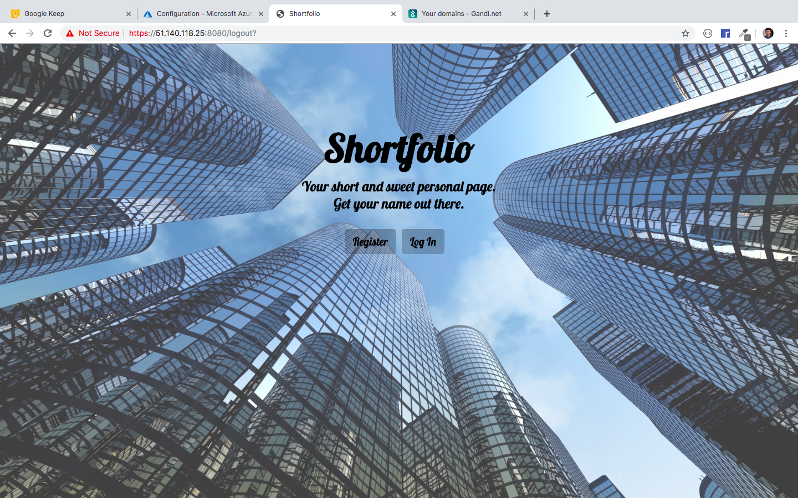
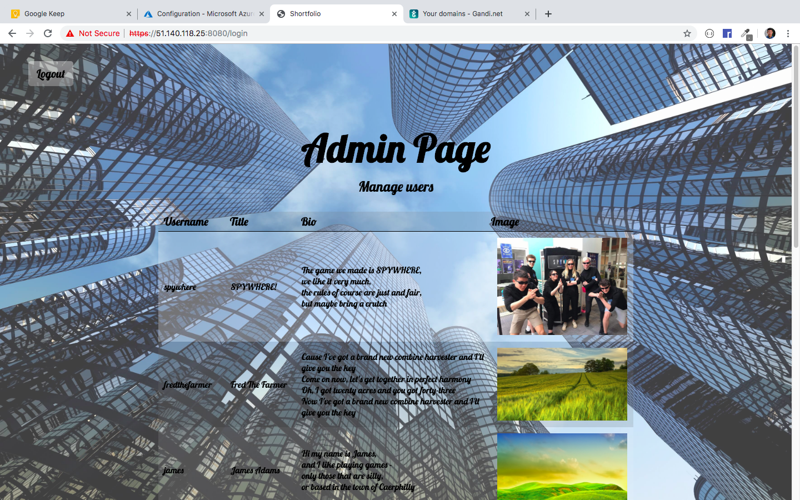
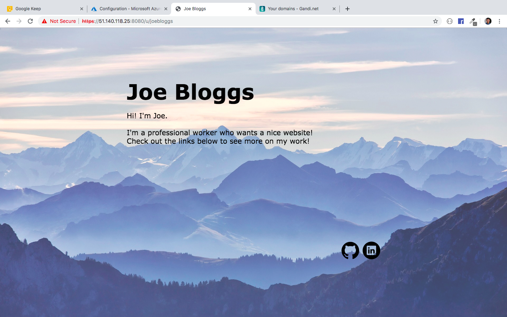

# COMSM0104 Web Technologies

Shortfolio allows anyone to easily design and own their own personal website. The website is fully customisable and allows for a title, bio/summary, background image, font, and social media links.

A user registers with a username and password, and can at any time visit their site through

- `https://shortfolio.site:8080/` until I work out reverse proxies
- or `https://localhost:8080/u/username` if running locally

The https certificate is self signed and so your browser will likely ask your permission to proceed.

This project was worked on alone by Louis Heath, candidate no. 37025.

Once unzipped, the server can be run with 

```
npm install
npm start
````

When building a personal site you may wish to set your own background image. Landscape images work the best - here are some example images you might choose to use

- https://imgur.com/raNseyb
- https://imgur.com/0g3qZPR

## Screenshots

<table width="100%">
  <tr>
    <td></td>
    <td></td>
  </tr>
  <tr>
    <td><p>Homepage</td>
    <td><p>Login screen</td>
  </tr>
  <tr>
    <td></td>
    <td></td>
  </tr>
  <tr>
    <td><p>Admin page</td>
    <td><p>A personal site</td>
  </tr>
</table>

## Self Assessment

### HTML

A

This project has shown my competency with HTML and that I am confident using a variety of elements, ranging from tables to custom styled divs.

My HTML is validated as xhtml using w3schools' validator.

### CSS

A

I have used CSS to produce a consistent design and theme across all pages of the website.

The files are separated and organised to accommodate for page-specfic styling, however due to the consitency in the theme I have been able to reuse the majority of the sames styles for each page, resulting in clean and modular class names.

I have used CSS transitions and keyframes to provide subtle yet effective animations, such as the glowing and bulging of buttons, or the fading in of new page content.

### JS

A

My website is simple by design in order to achieve a clean and professional look, and therefore warrants minimal animations. Most dynamicism is achieved through the templating engine HBS, and small UX animations such as the glowing and bulging of buttons are achieved through CSS transitions and animations.

I do however utilise front-end javacscript in my website. One example is to change the text on my custom styled file input button, on the Edit page. This is necessary as part of my styling process I had to hide the `file input` and its accompanying text label, and style a `label` element instead. This choice was made so that the button appeared the same amongst all browsers, as they all style file upload buttons differently, but tend to style labels similarly.

Another significant use of front-end JavaScript can be found on the admin page, in which I enable the admin to view all of the currently registered users for Shortfolio, and optionally delete some through a JS animated pop-up. This page can be reached by logging in to the admin account. Login details can be found in `readme.md`.

### PNG

A

I used GIMP to create original artwork, depicting my dog in Cornwall in the middle of a sci-fi war between Godzilla and the Millennium Falcon. 

This involved working with multiple layers and removing backgrounds, as well as using tools such as smudge, crop etc.

The end product can be seen at https://shortfolio.site:8080/u/demo.

### SVG

A

Using Inkscape I was able to create custom icons for the Github and Linkedin links which users can optionally add to their page. I was able to import png versions of the original logos, and use `Path > Trace Bitmap` to convert them into paths. Using the boolean Path functions I was able to create my own round icons by cutting the logo paths from a circle. I could then insert more nodes and modify their position and direction to smooth off the corners.

These icons can be seen at https://shortfolio.site:8080/u/joebloggs

### Server

A

My server is configured to use HTTPS with a self-signed certificate. I utilise cookies to preserve a user's login session once they have authenticated. The log in system uses password hashing and salting, and the session cookies utilise the JSON Web Token format.

My codebase is organised such that each file implements a different area of the app, in attempt to minimise clutter. For example all endpoints associated to the editing of a user's site are found in `routes/edit.js`.

I have hosted the website online on a Microsoft Azure Virtual Machine. It can be accessed at https://51.140.118.25:8080 or https://shortfolio.site:8080.

### Database

A

I have a fully functioning SQLite database in my website which I add to, update and delete from through various website interactions. User rows are created on registration and can be deleted through the admin management panel. The users are able to be modified through the website's Edit functionality in which they can edit each section of their site in turn.

All functions involving direct database access through SQLite queries are separated into a `database` module. This file further splits each query into its own functions, returning a promise, allowing me to reuse them when writing more complex database functions and simply chain the promises together.

### Dynamic pages

A

I have been utilising the Handlebars.js templating engine for Node.js. This has allowed me to inject different data depending on which user is logged in or on which user is being viewed. I have utilised its more advanced features such as `{{#each items}}` which allows me to generate arbitrary rows of users, for example, or variable numbers of social media links. I have also been able to utilise their `fragment` system which significantly improves the maintainability of templates.

### Noteworthy efforts 

My website depends largely on its ability to store large images and quickly serve them. I was able to save them locally within my server, or in the database as a blob, but I chose to utilise the API provided by Imgur, and store my images with them. This has enabled me to simply save a url to the image in the database and quickly fetch the data on demand.

I have put a signifcant amount of time and effort into the visual design and navigation of the site. The purpose of the site is to provide simplistic yet professional personal portfolios, and so I wanted to user experience to reflect that throughout.